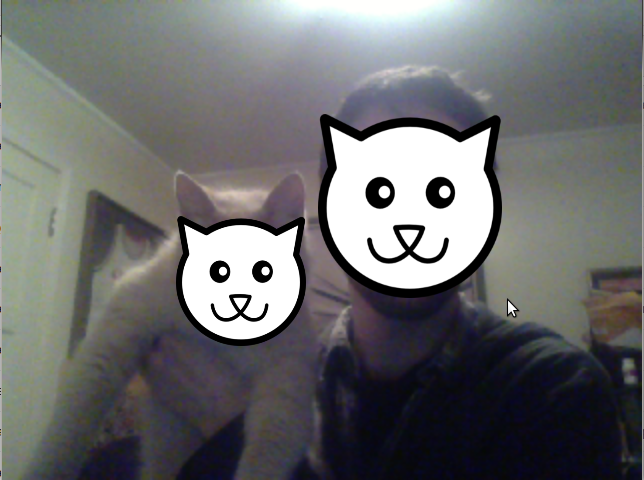

# ACHIEVE YR DREAMS: BECOME A CAT 

It draws a cat face on top of faces that are detected with OpenCV

requires opencv_processing
cat face can be changed by renaming the loadimage path and altering the numbers here:
    image(cat, faces[i].x + faces[i].width / 2, faces[i].y + faces[i].height / 2, faces[i].width * 1.5, faces[i].height * 2.5);
